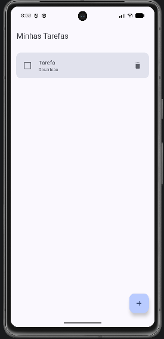
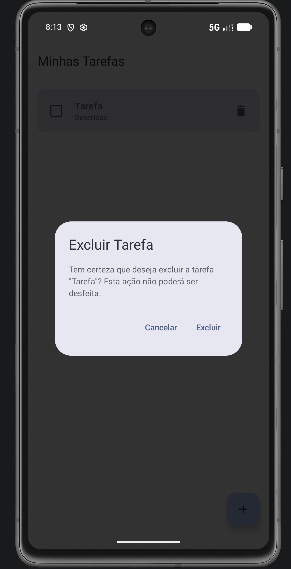
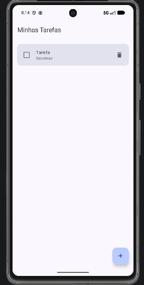
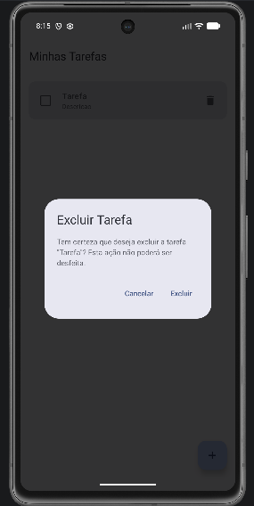
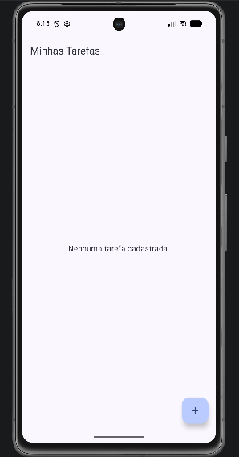

# Evidências — Exclusão de Tarefa

Este documento apresenta, em sequência, as evidências do fluxo de exclusão
de uma tarefa na aplicação TodoList.

## 1. Lista antes da exclusão

A tarefa selecionada para exclusão aparece normalmente na lista.

## 2. Diálogo de confirmação aberto

O diálogo de confirmação é exibido após selecionar a tarefa para exclusão.

## 3. Resultado ao cancelar

Após selecionar a opção de cancelamento, o diálogo é fechado e a tarefa
permanece na lista.

## 4. Diálogo aberto novamente

O diálogo é aberto novamente para a mesma tarefa, permitindo confirmar
novamente a operação de exclusão.

## 5. Resultado após confirmar a exclusão

Após confirmar a exclusão, a tarefa deixa de aparecer na lista.

