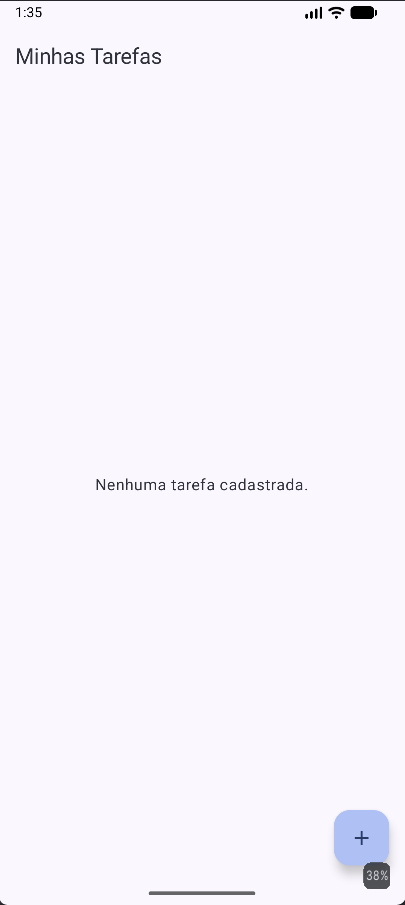
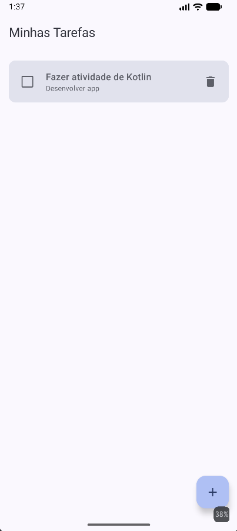
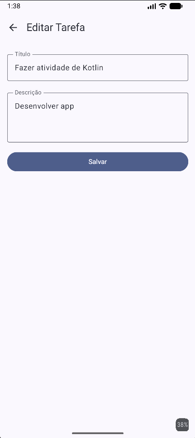

# TodoList - Gerenciador de Tarefas Kotlin

Este projeto é uma aplicação de lista de tarefas (To-Do List) desenvolvida em Kotlin para Android, utilizando as tecnologias mais modernas recomendadas pelo Google para o desenvolvimento nativo.

## 🎯 Objetivo
O objetivo da aplicação é permitir que o usuário gerencie suas atividades diárias, podendo criar, visualizar, editar e excluir tarefas, além de marcá-las como concluídas.

## 🚀 Tecnologias Utilizadas
- **Kotlin**: Linguagem principal do projeto.
- **Jetpack Compose**: Toolkit moderno para construção de interfaces declarativas.
- **Room Database**: Biblioteca de persistência de dados local sobre o SQLite.
- **Coroutines & Flow**: Para processamento assíncrono e fluxos de dados reativos.
- **ViewModel**: Para gerenciamento de estado da UI e lógica de negócio sensível ao ciclo de vida.
- **Navigation Compose**: Para navegação entre telas de forma tipada e reativa.

---

## 🏛️ Arquitetura
A aplicação segue o padrão de arquitetura **MVVM (Model-View-ViewModel)** aliado ao **Repository Pattern**, garantindo separação de responsabilidades e facilidade de manutenção.

### 1. Camada de Dados: `TarefaRepository`
O `TarefaRepository` atua como uma camada de abstração entre o DAO (Data Access Object) do Room e a ViewModel. 
- **Responsabilidade**: Centralizar o acesso aos dados, permitindo que a ViewModel não precise conhecer os detalhes da persistência.
- **Funcionalidades**: Expõe o fluxo de tarefas (`Flow`) e fornece métodos `suspend` para as operações de CRUD.

### 2. Lógica de Negócio: `TarefaViewModel`
A `TarefaViewModel` gerencia o estado da interface do usuário.
- **Estado Reativo**: Transforma o `Flow` vindo do repositório em um `StateFlow` utilizando o operador `stateIn`. Isso garante que a UI receba atualizações em tempo real e de forma eficiente.
- **Escopo**: Utiliza o `viewModelScope` para disparar coroutines que executam as operações no banco de dados, garantindo que as operações sejam canceladas se a ViewModel for destruída.

### 3. Interface do Usuário (UI)

#### `ListaTarefasScreen`
Esta tela é responsável por exibir a lista de tarefas cadastradas.
- **Observação de Estado**: Utiliza `collectAsStateWithLifecycle` para observar as mudanças no `StateFlow` da ViewModel, reagindo automaticamente a qualquer alteração nos dados.
- **Ações**: Dispara eventos para a ViewModel (marcar como concluída, deletar) e para o NavController (navegar para criação ou edição).

#### `FormularioTarefaScreen`
Uma tela versátil utilizada tanto para criar novas tarefas quanto para editar as existentes.
- **Diferenciação**: Recebe um `tarefaId`. Se o ID for `0`, a tela se comporta como um formulário de cadastro. Se for diferente de `0`, ela busca a tarefa existente no estado para preencher os campos, permitindo a edição.

### 4. Navegação: `AppNavigation`
Centraliza a configuração das rotas da aplicação.
- **Configuração**: Define as rotas `"lista"` e `"formulario/{tarefaId}"`.
- **Passagem de Parâmetros**: Extrai o `tarefaId` da rota do formulário e o converte para inteiro, permitindo que a tela de formulário saiba qual operação realizar.

### 5. Ponto de Entrada: `MainActivity`
A `MainActivity` inicializa o ecossistema da aplicação.
- **Injeção de Dependência**: Cria a instância da `TarefaViewModel` utilizando uma `Factory` personalizada, que injeta o repositório e o DAO configurados.
- **Navegação**: Define o conteúdo principal da atividade como o componente `AppNavigation`.

---

## 🛠️ Como Executar o Projeto
1. Clone este repositório.
2. Abra o projeto no **Android Studio (Ladybug ou superior)**.
3. Certifique-se de que o SDK do Android está configurado corretamente.
4. Execute o projeto em um Emulador ou Dispositivo Físico.

---

## 📸 Evidências
Abaixo, capturas de tela demonstrando o funcionamento da aplicação:

| Lista Vazia | Cadastro de Tarefa | Lista com Tarefas | Edição de Tarefa |
|:---:|:---:|:---:|:---:|
|  |  |  |  |

> [!NOTE]
> As imagens acima são ilustrativas do fluxo implementado durante a atividade.
